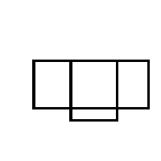

Portions of the following were adapted 
from "[dippl fork roomlayout](http://www.adrian-haarbach.de/dippl/examples/roomlayout.html)" 
and "[probmodsv2 inference-algorithms](inference-algorithms.html)" 
and "[Notes of the PPAML Summer School 2016](http://probmods.github.io/ppaml2016/)"
and "[Procedural Modeling 3D Spaceship example](http://dritchie.github.io/web-procmod/)".

## Floorplan layouts

The following scene layouts were extracted from 3D-Front dataset from scenes having 4 rooms

## Analytic Solutions

Even when all the variables are categorical, problems arise quickly. As a program makes more random choices, and as these choices gain more possible values,
the number of possible execution paths through the program grows exponentially. Explicitly enumerating all of these paths can be prohibitively expensive.
For instance, consider this program which computes the posterior distribution on rendered 2D boxes, conditioned on those boxes approximately matching this target image:

~~~~
///fold:Rectangle Drawing
var targetImage = Draw(200, 200, false);
loadImage(targetImage, "../assets/img/layout-4/a87e4d8d-538c-4455-98c2-3322e7fc2bf0.png_inv.png");

var drawRectangles = function(drawObj, lines){
  var line = lines[0];
  drawObj.rectangle(line[0], line[1], line[2], line[3]);
  if (lines.length > 1) {
    drawRectangles(drawObj, lines.slice(1));
  }
};

var makeRectangles = function(n, lines, prevScore){
  var x1 = randomInteger(200);
  var y1 = randomInteger(200);
  var x2 = randomInteger(200);
  var y2 = randomInteger(200);

  var newLines = lines.concat([[x1, y1, x2, y2]]);
  // Compute image from set of lines
  var generatedImage = Draw(200, 200, false);
  drawRectangles(generatedImage, newLines);
  
  // Factor prefers images that are close to target image
  var newScore = -targetImage.distance(generatedImage)/1000; // Increase to 10000 to see more diverse samples
  factor(newScore - prevScore);
  generatedImage.destroy();
  
  // Generate remaining lines (unless done)
  return (n==1) ? newLines : makeRectangles(n-1, newLines, newScore);
}
///

var lineDist = Infer(
  { method: 'enumerate', strategy: 'depthFirst', maxExecutions: 10 },
  function(){
    var lines = makeRectangles(4, [], 0);
    var finalGeneratedImage = Draw(200, 200, true);
    drawRectangles(finalGeneratedImage, lines);
    return lines;
  });

viz.table(lineDist);
~~~~

Running this program, we can see that enumeration starts by growing a line from the bottom-right corner of the image, and then proceeds to methodically plot out every possible line length that could be generated. These are all fairly terrible at matching the target image, and there are billions more states like them that enumeration would have to wade through in order to find those few that have high probability.

## Approximate Inference

Luckily, it is often possible to estimate the posterior probability fairly accurately, even though we cannot calculate it exactly. There are a number of different algorithms, each of which has different properties.

### Rejection Sampling vs Enumeration vs Markov chain Monte Carlo (MCMC)
~~~~
var baserate = 0.1

var model = function(){
  var A = flip(baserate)
  var B = flip(baserate)
  var C = flip(baserate)
  condition(A+B+C >= 2)
  return A
}

viz(Infer({method: 'rejection', samples: 100}, model))
viz(Infer({method: 'enumerate'}, model))
viz(Infer({method: 'MCMC', lag: 100}, model))
~~~~
With rejection sampling, each sample is an independent draw from the model's prior. Markov chain Monte Carlo, in contrast involves a random walk through the posterior. Each sample depends on the prior sample -- but ony the prior sample (it is a *Markov* chain). We describe this in more detail below.

Importantly, while you can approximate an arbitrary conditional distribution with arbitrary precision using rejection sampling or MCMC if you run the algorithms long enough, MCMC tends to approach the conditional distribution much more rapidly. Consider again this simple model:

Again, see what happens in the above inference as you lower the baserate. Unlike rejection sampling, inference will not slow down appreciably, though results will become less stable. Unlike enumeration, inference should also not slow down exponentially as the size of the state space is increased.
This is an example of the kind of tradeoffs that are common between different inference algorithms.

Next, we provide more intuition on how MCMC works. 

Thus, MCMC involves identifying a Markov chain whose stationary distribution matches the condition distribution you'd like to estimate. That is, you want a Markov chain such that in the limit a histogram (or density plot) of states in the Markov chain approaches the conditional distribution in question. 

As we have already seen, each successive sample from a Markov chain is highly correlated with the prior state. (Why?). To see another example, let's return to our attempt to match the 2D image. This time, we will take 50 MCMC samples:

~~~~
///fold:Rectangle Drawing
var targetImage = Draw(200, 200, false);
loadImage(targetImage, "../assets/img/layout-4/a87e4d8d-538c-4455-98c2-3322e7fc2bf0.png_inv.png");

var drawRectangles = function(drawObj, lines){
  var line = lines[0];
  drawObj.rectangle(line[0], line[1], line[2], line[3]);
  if (lines.length > 1) {
    drawRectangles(drawObj, lines.slice(1));
  }
};

var makeRectangles = function(n, lines, prevScore){
  var x1 = randomInteger(200);
  var y1 = randomInteger(200);
  var x2 = randomInteger(200);
  var y2 = randomInteger(200);

  var newLines = lines.concat([[x1, y1, x2, y2]]);
  // Compute image from set of lines
  var generatedImage = Draw(200, 200, false);
  drawRectangles(generatedImage, newLines);
  
  // Factor prefers images that are close to target image
  var newScore = -targetImage.distance(generatedImage)/1000; // Increase to 10000 to see more diverse samples
  factor(newScore - prevScore);
  generatedImage.destroy();
  
  // Generate remaining lines (unless done)
  return (n==1) ? newLines : makeRectangles(n-1, newLines, newScore);
}
///

var lineDist = Infer(
  { method: 'MCMC', samples: 50},
  function(){
    var lines = makeRectangles(4, [], 0);
    var finalGeneratedImage = Draw(200, 200, true);
    drawRectangles(finalGeneratedImage, lines);
    return lines;
  });

viz.table(lineDist);
~~~~

As you can see, each successive sample is highly similar to the previous one. Since the first sample is chosen randomly, the sequence you see will be very different if you re-run the model. If you run the chain long enough, these local correlations wash out. However, that can result in a very large collection of samples. For convenience, modelers sometimes record only every Nth states in the chain. WebPPL provides an option for MCMC called `'lag'`, which we actually saw in the first example from this section.

<!--
To construct a Markov chain that converges to a stationary distribution of interest, we also need to ensure that any state can be reached from any other state in a finite number of steps. This requirement is called *ergodicity*. If a chain is not ergodic, it may still leave the stationary distribution unchanged when the transition operator is applied, but the chain will not reliably converge to the stationary distribution when initialized with a state sampled from an arbitrary distribution.
-->

#### Metropolis-Hastings

Fortunately, it turns out that for any given (condition) distribution we might want to sample from, there is at least one Markov chain with a matching stationary distribution. There are a number of methods for finding an appropriate Markov chain. One particularly common method is *Metropolis Hastings* recipe. 

To create the necessary transition function, we first create a *proposal distribution*, $$q(x\rightarrow x')$$, which does not need to have the target distribution as its stationary distribution, but should be easy to sample from (otherwise it will be unwieldy to use!). A common option for continuous state spaces is to sample a new state from a multivariate Gaussian centered on the current state. To turn a proposal distribution into a transition function with the right stationary distribution, we either accepting or reject the proposed transition with probability: $$\min\left(1, \frac{p(x')q(x'\rightarrow x)}{p(x)q(x\rightarrow x')}\right).$$
That is, we flip a coin with that probability: if it comes up heads our next state is $x'$, otherwise our next state is still $$x$$.

Such a transition function not only satisfies the *balance condition*, it actually satisfies a stronger condition, *detailed balance*. Specifically, $$p(x)\pi(x \rightarrow x') = p(x')\pi(x' \rightarrow x)$$.
(To show that detailed balance implies balance, substitute the right-hand side of the detailed balance equation into the balance equation, replacing the summand, and then simplify.) It can be shown that the *Metropolis-hastings algorithm* gives a transition probability (i.e. $$\pi(x\rightarrow x')$$) that satisfies detailed balance and thus balance. (Recommended exercise: prove this fact. Hint: the probability of transitioning depends on first proposing a given new state, then accepting it; if you don't accept the proposal you "transition" to the original state.)

Note that in order to use this recipe we need to have a function that computes the target probability (not just one that samples from it) and the transition probability, but they need not be normalized (since the normalization terms will cancel).

<!--
For background on MH and MCMC, see the excellent introductions by David MacKay ([Chapter 29](http://www.inference.phy.cam.ac.uk/mackay/itprnn/ps/356.384.pdf) and [30](http://www.inference.phy.cam.ac.uk/mackay/itprnn/ps/387.412.pdf) of Information Theory, Inference, and Learning Algorithms) or [Radford Neal](http://www.cs.utoronto.ca/~radford/review.abstract.html).
-->

#### Hamiltonian Monte Carlo

WebPPL's `method:'MCMC'` uses *Metropolis-Hastings* by default. However, it is not the only option, nor is it always the best. When the input to a `factor` statement is a function of multiple variables, those variables become correlated in the posterior distribution. If the induced correlation is particularly strong, MCMC can sometimes become 'stuck.' In controling the random walk, Metropolis-Hastings choses a new point in probability space to go to and then decides whether or not to go based on the probability of the new point. If it has difficulty finding new points with reasonable probability, it will get stuck and simplly stay where it is. Given an infinite amount of time, Metropolis-Hastings will recover. However, the first N samples will be heavily dependent on where the chain started (the first sample) and will be a poor approximation of the true posterior. 

Take this example below, where we use a Gaussian likelihood factor to encourage ten uniform random numbers to sum to the value 5:

~~~~
var bin = function(x) {
  return Math.floor(x * 1000) / 1000;
};

var constrainedSumModel = function() {
  var xs = repeat(10, function() {
    return uniform(0, 1);
  });
  var targetSum = xs.length / 2;
  observe(Gaussian({mu: targetSum, sigma: 0.005}), sum(xs));
  return map(bin, xs);
};

var post = Infer({
	method: 'MCMC',
	samples: 5000,
	callbacks: [MCMC_Callbacks.finalAccept]
}, constrainedSumModel);
var samps = repeat(10, function() { return sample(post); });
reduce(function(x, acc) {
	return acc + 'sum: ' + sum(x).toFixed(3) + ' | nums: ' + x.toString() + '\n';
}, '', samps);
~~~~

The output box displays 10 random samples from the posterior. You'll notice that they are all very similiar, despite there being many distinct ways for ten real numbers to sum to 5. The reason is technical but straight-forward.  The program above uses the `callbacks` option to `MCMC` to display the final acceptance ratio (i.e. the percentage of proposed samples that were accepted)--it should be around 1-2%, which is very inefficient.

To deal with situations like this one, WebPPL provides an implementation of [Hamiltonian Monte Carlo](http://docs.webppl.org/en/master/inference.html#kernels), or HMC. HMC automatically computes the gradient of the posterior with respect to the random choices made by the program. It can then use the gradient information to make coordinated proposals to all the random choices, maintaining posterior correlations. Below, we apply HMC to `constrainedSumModel`:

~~~~
///fold:
var bin = function(x) {
  return Math.floor(x * 1000) / 1000;
};

var constrainedSumModel = function() {
  var xs = repeat(10, function() {
    return uniform(0, 1);
  });
  var targetSum = xs.length / 2;
  observe(Gaussian({mu: targetSum, sigma: 0.005}), sum(xs));
  return map(bin, xs);
};
///

var post = Infer({
	method: 'MCMC',
	samples: 100,
	callbacks: [MCMC_Callbacks.finalAccept],
	kernel: {
		HMC : { steps: 50, stepSize: 0.0025 }
	}
}, constrainedSumModel);
var samps = repeat(10, function() { return sample(post); });
reduce(function(x, acc) {
	return acc + 'sum: ' + sum(x).toFixed(3) + ' | nums: ' + x.toString() + '\n';
}, '', samps);
~~~~

The approximate posterior samples produced by this program are more varied, and the final acceptance rate is much higher.

There are a couple of caveats to keep in mind when using HMC:

 - Its parameters can be extremely sensitive. Try increasing the `stepSize` option to `0.004` and seeing how the output samples degenerate. 
 - It is only applicable to continuous random choices, due to its gradient-based nature. You can still use HMC with models that include discrete choices, though: under the hood, this will alternate between HMC for the continuous choices and MH for the discrete choices.

### HMC for rectangle drawing

~~~~
///fold:Rectangle Drawing
var targetImage = Draw(200, 200, false);
loadImage(targetImage, "../assets/img/layout-4/a87e4d8d-538c-4455-98c2-3322e7fc2bf0.png_inv.png");

var drawRectangles = function(drawObj, lines){
  var line = lines[0];
  drawObj.rectangle(line[0], line[1], line[2], line[3]);
  if (lines.length > 1) {
    drawRectangles(drawObj, lines.slice(1));
  }
};

var makeRectangles = function(n, lines, prevScore){
  var x1 = randomInteger(200);
  var y1 = randomInteger(200);
  var x2 = randomInteger(200);
  var y2 = randomInteger(200);

  var newLines = lines.concat([[x1, y1, x2, y2]]);
  // Compute image from set of lines
  var generatedImage = Draw(200, 200, false);
  drawRectangles(generatedImage, newLines);
  
  // Factor prefers images that are close to target image
  var newScore = -targetImage.distance(generatedImage)/1000; // Increase to 10000 to see more diverse samples
  factor(newScore - prevScore);
  generatedImage.destroy();
  
  // Generate remaining lines (unless done)
  return (n==1) ? newLines : makeRectangles(n-1, newLines, newScore);
}
///

var lineDist = Infer(
  { method: 'MCMC', samples: 50, 
      kernel: {
      	HMC : { steps: 50, stepSize: 0.0025 }
      }
  },
  function(){
    var lines = makeRectangles(4, [], 0);
    var finalGeneratedImage = Draw(200, 200, true);
    drawRectangles(finalGeneratedImage, lines);
    return lines;
  });

viz.table(lineDist);

~~~~

### Particle Filters

Particle filters -- also known as [Sequential Monte Carlo](http://docs.webppl.org/en/master/inference.html#smc) -- maintain a collection of samples (particles) that are resampled upon encountering new evidence. They are particularly useful for models that incrementally update beliefs as new observations come in. Before considering such models, though, let's get a sense of how particle filters work. Below, we apply a particle filter to our 2D image rendering model, using `method: 'SMC'`.

~~~~
///fold:Rectangle Drawing
var targetImage = Draw(200, 200, false);
loadImage(targetImage, "../assets/img/layout-4/a87e4d8d-538c-4455-98c2-3322e7fc2bf0.png_inv.png");

var drawRectangles = function(drawObj, lines){
  var line = lines[0];
  drawObj.rectangle(line[0], line[1], line[2], line[3]);
  if (lines.length > 1) {
    drawRectangles(drawObj, lines.slice(1));
  }
};

var makeRectangles = function(n, lines, prevScore){
  var x1 = randomInteger(200);
  var y1 = randomInteger(200);
  var x2 = randomInteger(200);
  var y2 = randomInteger(200);

  var newLines = lines.concat([[x1, y1, x2, y2]]);
  // Compute image from set of lines
  var generatedImage = Draw(200, 200, false);
  drawRectangles(generatedImage, newLines);
  
  // Factor prefers images that are close to target image
  var newScore = -targetImage.distance(generatedImage)/1000; // Increase to 10000 to see more diverse samples
  factor(newScore - prevScore);
  generatedImage.destroy();
  
  // Generate remaining lines (unless done)
  return (n==1) ? newLines : makeRectangles(n-1, newLines, newScore);
}
///

var numParticles = 100;

var post = Infer(
  {method: 'SMC', particles: numParticles},
  function(){
    return makeRectangles(4, [], 0);
   });

repeat(20, function() {
  var finalGeneratedImage = Draw(200, 200, true);
  var lines = sample(post);
  drawRectangles(finalGeneratedImage, lines);
});
~~~~

Try running this program multiple times. Note that while each run produces different outputs, within a run, all of the output particles look extremely similar. We will return to this issue later on in the next section.

Notice the variable `numParticles`. This sets the number of estimates (particles) drawn at each inference step. More particles tends to mean more precise estimates. Try adjusting `numParticles` in order to see the difference in accuracy.